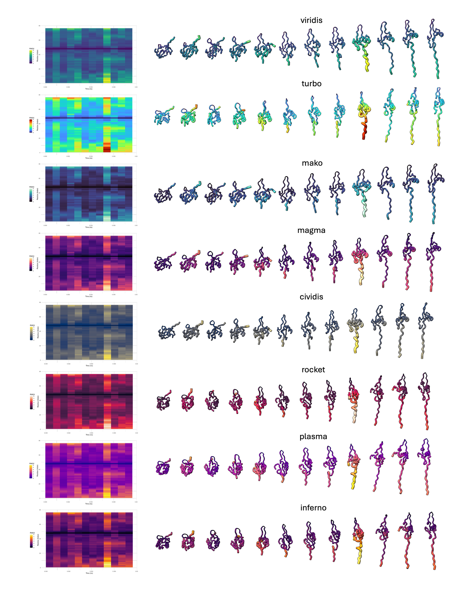
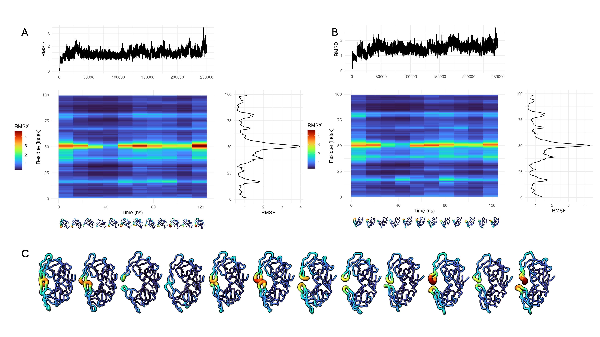

# RMSDxRMSF = RMSX
RMSX combines the features of RMSD and RMSF into a simple-to-understand and simple-to-implement tool for understanding how proteins move. It can work with simulation files from across MD simulation suites (e.g., GROMACS and NAMD, Amber etc.) and is much faster than other visualization methods while delivering publication-ready images out of the box. 




### 1. Prerequisites (click for install instructions) 
- [**Git**](https://git-scm.com/book/en/v2/Getting-Started-Installing-Git#:~:text=Installing%20on%20Windows&text=Just%20go%20to%20https%3A%2F%2F,to%20https%3A%2F%2Fgitforwindows.org.) Installed and added to your path (likely already done if you are using macOS or Linux)
- [**Python**](https://www.python.org/) If not already installed (tested with 3.8+)
- [**Jupyter Notebooks**](https://phoenixnap.com/kb/install-jupyter-notebook#:~:text=Install%20Jupyter%20Notebook%20on%20Linux,via%20pip) (Recommended) 
- [**R**](https://cran.r-project.org/) installed and in your PATH (the `Rscript` command must be available).
- [**ChimeraX**](https://www.cgl.ucsf.edu/chimerax/download.html) if you plan to use the **Flipbook** 3D visualization.
- The RMSX code will attempt to install R packages like `ggplot2`, `viridis`, `dplyr`, etc., if they’re missing.
  

### 2. Installation

Once you have those installed, just download and run the [**Quick Start Guide Notebook**](https://github.com/AntunesLab/rmsx/releases/tag/v0.2.2#:~:text=3-,RMSX_FlipBook_Quickstart.ipynb,-sha256%3A345588afc20bcf4375679e8aa1764dfd4d9c4dfac2642da58d4265f6a43d341e)
It will walk you through the process and allow you to try RMSX, Trajectory Maps, and Flipbook on your own trajectories or ones from our publication.

1. **Clone this repository**:
   ```bash
   git clone https://github.com/AntunesLab/rmsx.git
   ```

2. **Install RMSX** in editable mode:
   ```bash
   cd rmsx
   pip install -e .
   ```
   This also installs the required Python libraries (e.g., MDAnalysis).

*(If installing on HPC or unusual platforms, you may need to manually install R libraries, but typically the R script handles that automatically.)*

### 3. Single-Chain Analysis Example

Below is a minimal example showing how to analyze **one chain**. We add a brief comment for each parameter:

```python
from rmsx import run_rmsx

pdb_file = "/path/to/your_structure.pdb"   # Topology file (PDB or GRO)
dcd_file = "/path/to/your_trajectory.dcd" # Trajectory file (DCD, XTC, etc.)
output_dir = "/path/to/output_directory"  # Folder where results go

run_rmsx(
    topology_file=pdb_file,        # PDB or topology file
    trajectory_file=dcd_file,      # Trajectory file
    output_dir=output_dir,         # Location for RMSX outputs
    num_slices=9,                  # Divide trajectory into 9 slices
    slice_size=None,               # (Alternately specify slice_size in frames)
    rscript_executable='Rscript',  # Path to Rscript
    verbose=True,                  # Print detailed logs
    interpolate=False,             # Disable heatmap interpolation
    triple=True,                   # Generate RMSX, RMSD, and RMSF plots
    overwrite=True,                # Overwrite existing folder
    palette="mako",                # Color palette
    chain_sele="A",                # Target chain ID
    start_frame=0,                 # First frame to analyze
    end_frame=None                 # Last frame (None = all frames)
)
```

**What it does**:
1. Reads frames from your trajectory, slices them, computes RMSX (slice-wise RMSF).
2. Also calculates RMSD and RMSF for the full simulation (if `triple=True`).
3. Creates raster heatmaps (`.png`) with the chosen palette and optionally a triple-plot figure.
4. Updates `.pdb` slice files in the output directory, storing RMSX values in the B-factor column.

### 4. Multi-Chain Analysis

If your system has multiple chains (e.g., chain A, chain B):

```python
from rmsx import all_chain_rmsx

pdb_file_multi = "/path/to/multichain_structure.pdb"
traj_file_multi = "/path/to/multichain_trajectory.xtc"
output_dir_multi = "/path/to/multichain_output"

all_chain_rmsx(
    topology_file=pdb_file_multi,       # Multi-chain structure
    trajectory_file=traj_file_multi,    # Trajectory
    output_dir=output_dir_multi,        # Output folder
    num_slices=12,                      # Number of slices
    slice_size=None,                    # or specify frames per slice
    rscript_executable='Rscript',
    verbose=True,
    interpolate=False,
    triple=True,
    overwrite=True,
    palette="turbo",
    start_frame=0,
    end_frame=None,
    sync_color_scale=True  # Use a shared color scale across all chains
)
```

**What it does**:
1. Detects each chain ID in the topology.
2. Runs per-chain RMSX (and RMSD/RMSF) analysis.
3. If `sync_color_scale=True`, waits until all chains’ data is computed, finds a global min/max, and then plots each chain’s heatmap using the same color range.

### 5. Flipbook Visualization

To **analyze** your system and **automatically generate** a 3D “flipbook” (multi-model PDB) for ChimeraX, use:

```python
from rmsx import run_rmsx_flipbook

run_rmsx_flipbook(
    topology_file=pdb_file,        # Topology (PDB/GRO)
    trajectory_file=dcd_file,      # Trajectory
    output_dir=output_dir,         # Output folder
    num_slices=9,                  # or slice_size=...
    rscript_executable='Rscript',
    verbose=True,
    interpolate=False,
    triple=True,                   # Also generate RMSD & RMSF plots
    overwrite=True,
    palette="mako",
    spacingFactor="0.6",           # Space out models for clarity
    start_frame=0,
    end_frame=None
)
```

1. Produces the RMSX heatmaps/plots just like `run_rmsx`.
2. Writes multiple **PDB models** (one per time slice) into a single file.
3. Launches UCSF ChimeraX (if installed) with the resulting “flipbook” so you can step through slices in 3D.  
   - **Note**: In a notebook environment, the cell may not complete until you close ChimeraX.

### 6. Additional Notes

- **Chain IDs**: If your PDB has chain “A” or “B”, but `chain_sele="C"` is passed, you’ll see errors or zero B-factors. Ensure the chain ID matches.
- **Residue Numbering**: If your PDB numbering starts at 100, but your trajectory references 1–100, you might see zero B-factors. Make sure they match.
- **ChimeraX**: [Download here](https://www.cgl.ucsf.edu/chimerax/download.html) if you’d like to visualize the flipbook.
- **Jupyter Notebook Behavior**: If you call `run_rmsx_flipbook` inside a Jupyter cell, ChimeraX runs interactively. The next cell won’t run until you **close** ChimeraX (or run it in detached mode).

---

**That’s it!** For more examples and advanced usage (like changing time frames, customizing color scale limits, or combining multi-chain PDB files), check the [**Quick Start Guide**](https://github.com/AntunesLab/rmsx/releases/tag/v0.2.2#:~:text=3-,RMSX_FlipBook_Quickstart.ipynb,-sha256%3A345588afc20bcf4375679e8aa1764dfd4d9c4dfac2642da58d4265f6a43d341e)
 and open an [issue on GitHub](https://github.com/AntunesLab/rmsx/issues) if you need further assistance.





